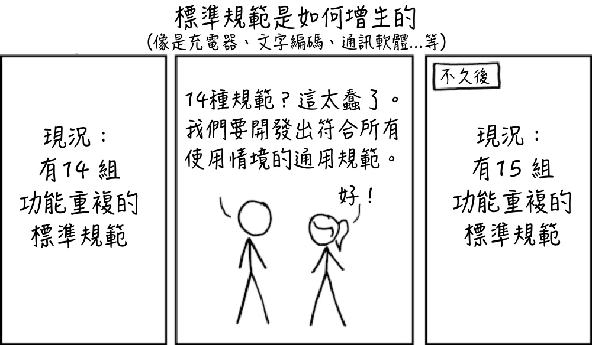
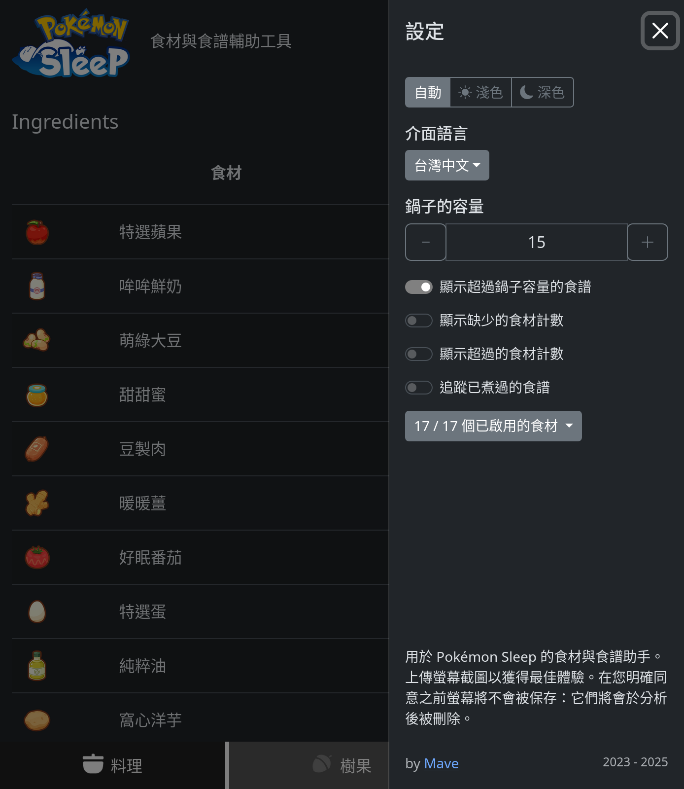
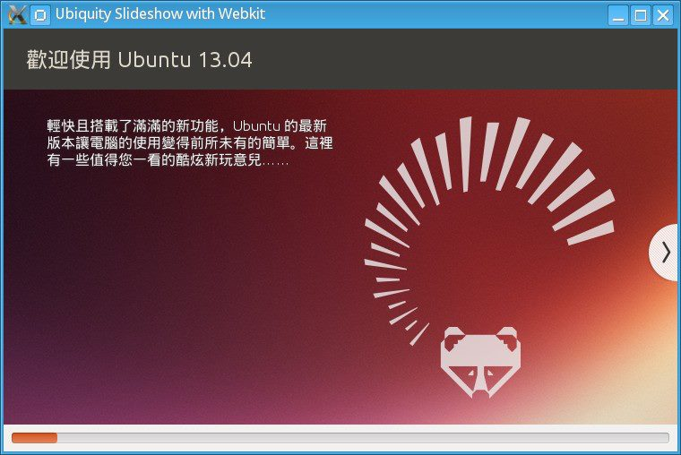
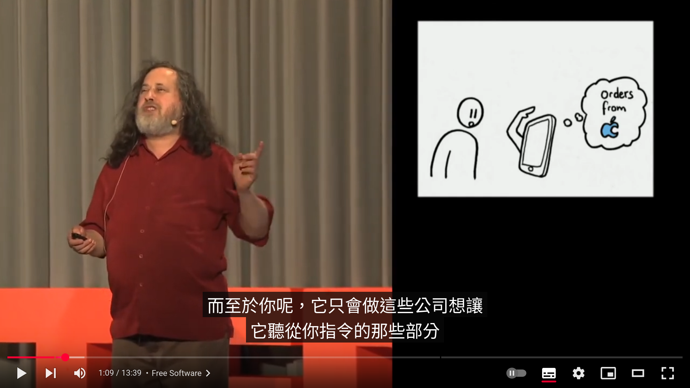
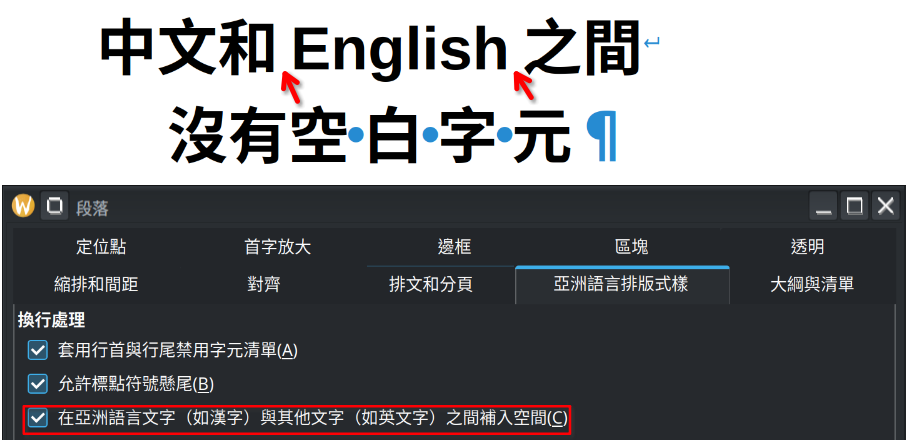
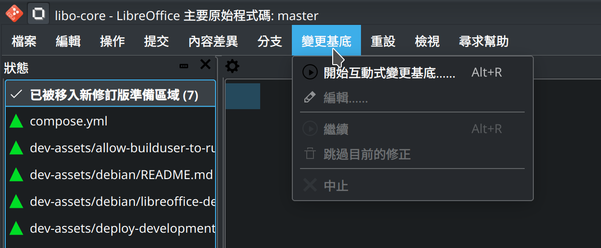
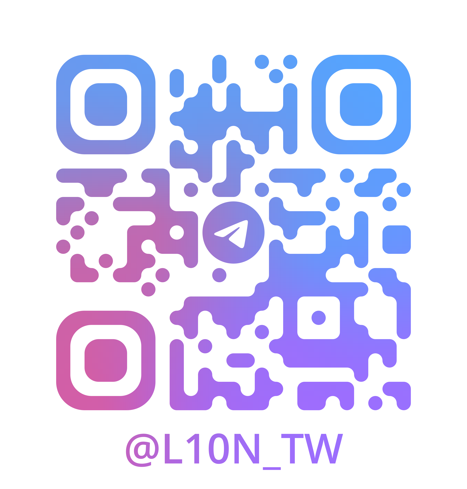

# 林博仁的台灣中文內容翻譯指引

林博仁 &lt;<https://brlin.me>&gt;

---

## 我是誰？

- 臺灣自由暨開源軟體在地化社群成員， ~~但是翻了不少專有軟體~~
- 從事 LibreOffice 等自由軟體開發工作，偶爾斜槓來作作台灣中文在地化 ~~，但都三分鐘熱度~~
- 台灣人

---

## 緣起

---

## 緣起（一言以蔽之）

由 CQD 所創作之 xkcd 非官方漫畫翻譯(CC-BY-NC-2.5)，來源：<https://xkcd.tw/927>

---

## 「內容」的定義

「內容」是指任何形式的資訊表達，包括但不限於：

* 文字（軟體界面、說明文件、網頁內容……）
* 圖片（梗圖、插圖……）
* 音訊（Podcast）
* 視訊（影片字幕……）

等媒體。

---

## ~~黑歷史~~ 範例（Git Cola）

---

## ~~黑歷史~~ 範例（Pokémon Sleep Tools）

---

## ~~黑歷史~~ 範例（Ubiquity）

---

## ~~黑歷史~~ 範例（Ubiquity(?)）

---

## ~~黑歷史~~ 範例（自由軟體，自由的社會：Richard Stallman 於 TEDxGeneva 2014 發表的演說）

---

## 翻譯的目標

盡可能地降低不同語言系統內容閱覽者理解內容涵義的成本

---

## 目標群體

您應以**內容的初學者**為目標群體來完善你的翻譯，翻譯應要是能夠在不偏離原意前提下讓初學者能夠**輕易理解並消化吸收**的。

如果一個翻譯會讓教育者無法簡單且精確地介紹給初學者的話（不包含「反正 ｘｘｘ 就是對應到 ｏｏｏ，至於為什麼你不用想<ruby>反正大家都這樣用<rt>因為我也不知道該怎麼解釋</rt></ruby>」），那那個翻譯可能就不是個好翻譯。

---

## 你應該翻譯什麼

* 平常有在用的軟體
* 符合你興趣、專業領域的軟體
* 說明文件、網站、推廣內容等

最好是在翻譯完後可以實際建構翻譯好的成果進行審閱，確保翻譯的內容是正確的。

## 你不應該翻譯什麼

* 你不熟悉/沒在用的軟體
* 為取得翻譯貢獻而翻譯
* 不是你的慣用語言的翻譯

也不是說絕對不能做，只是必須 **非常斟酌地** 進行。

---

## 盤古之白

因為當前大多數的<ruby>圖形化使用者界面<rt>graphical user interface(GUI)</rt></ruby>排版引擎尚未支援**自動在全形（中文）與半形（英數字等）字元間補入留白**影響視覺觀感所以我們**應**手動在全形字元與半形字元間插入單一空白字元以<ruby>規避<rt>workaround</rt></ruby>此問題。

錯誤範例：

> 於搜尋文字框中輸入cat跟game搜尋關鍵字

正確範例：

> 於搜尋文字框中輸入 cat 跟 game 搜尋關鍵字

---

## 盤古之白（可以省略之情境）

因為中式標點符號字元之兩側已經包含一定的空白，如半形字元任一側的全形字元為中式標點符號則該側的盤古之白**應**省略：

錯誤範例：

> 於文字輸入框中輸入： cat

正確範例：

> 於文字輸入框中輸入：cat

---

## 當我們不再需要盤古之白

如果未來<ruby>圖形化使用者界面<rt>graphical user interface</rt></ruby>排版引擎加入了盤古之白的支援再將這些手動插入之空白字元移除（理想上這些應該被自動偵測並直接被排版引擎忽略）。

---

## 文法

以下說明跟文法相關之注意事項：

---

### 標點符號

原則上**應**使用中式標點符號。

以下說明將內容翻譯為台灣中文時**應**注意的其他細節：

- **句號（。）**
- **逗號（，）**
- **頓號（、）**
- **分號（；）**  
- **冒號（：）**
- **問號（？）**
- **驚嘆號（！）**

---

#### 引號

原則上**應**將英式引號替換為中式引號：

錯誤範例：

> 於搜尋文字框中輸入"cat"跟"game"搜尋關鍵字

正確範例（一）：

> 於搜尋文字框中輸入「cat」跟「game」搜尋關鍵字

---

#### 引號（可以省略之情境）

因中英文外觀上的差異本來就足以突顯括住之內容，若確信引號括住之內容*一定*不會出現中文字**可**將引號直接省略：

正確範例（二）：

> 於搜尋文字框中輸入 cat 跟 game 搜尋關鍵字

如果不確定括住的內容是否會出現中文（如括住的內容為一變數）則**應**保留中式引號。

正確範例（三）：

> 於搜尋文字框中輸入「%s」搜尋關鍵字

---

#### 句號

<ruby>句子<rt>sentence</rt></ruby>應以中式句號作為結尾。

---

#### 句號（可以省略之情境）

一例外為在清單項目之內容，因美觀考量**應**將其省略：

錯誤範例：

> 今日行程安排：
>
> - 吃飯。
> - 睡覺。
> - 打東東。

正確範例：

> 今日行程安排：
>
> - 吃飯
> - 睡覺
> - 打東東

---

#### 刪節號

原則上使用「一個」全形的刪節號（…）或是三個英式句點（...）

---

### 副詞

副詞之翻譯應以「地」作為最後一個字元。

### 複合文句

有些英文文句由多種句式組合而成，如難以依照原文架構翻譯（原則上視其為原文的缺陷）可在不對語意造成顯著影響前提下將其**拆分多句**。

---

## 信達雅（起源）

>**信、達、雅**，由[中國近代](https://zh.wikipedia.org/wiki/%E4%B8%AD%E5%9B%BD%E8%BF%91%E4%BB%A3 "中國近代")啟蒙思想家、翻譯家[嚴復](https://zh.wikipedia.org/wiki/%E4%B8%A5%E5%A4%8D "嚴復")提出的[翻譯](https://zh.wikipedia.org/wiki/%E7%BF%BB%E8%AF%91 "翻譯")理論，又稱「三難原則」。出自嚴復譯著《[天演論](https://zh.wikipedia.org/wiki/%E5%A4%A9%E6%BC%94%E8%AB%96 "天演論")》中的「[譯例言](https://zh.wikisource.org/wiki/%E5%A4%A9%E6%BC%94%E8%AB%96/%E8%AD%AF%E4%BE%8B%E8%A8%80 "s:天演論/譯例言")」，其講到：「譯事三難：信、達、雅。求其信已大難矣，顧信矣不達，雖譯猶不譯也，則達尚焉。」[\[1\]](https://zh.wikipedia.org/zh-tw/%E4%BF%A1%E8%BE%BE%E9%9B%85#cite_note-1)
>
>- 「信」（faithfulness）指意義不悖原文，即是譯文要準確，不偏離，不遺漏，也不要隨意增減意思；
>- 「達」（expressiveness）指不拘泥於原文形式，譯文通順明白；
>- 「雅」（elegance）則指譯文時選用的詞語要得體，追求文章本身的古雅，簡明優雅。
>
>——摘錄自[由維基百科編者所撰寫之《信達雅》維基百科條目](https://zh.wikipedia.org/zh-tw/%E4%BF%A1%E8%BE%BE%E9%9B%85)

---

## 信達雅（個人定義）

我個人的理解為：

* 信：不偏離原文*字面上的*原意
* 達：讓閱覽者能順利地 *get* 到作者的意思（方式不限）
* 雅：翻譯的文句要唸起來通順，不讓閱覽者在唸得時候<u>皺起</u>眉頭~~會皺起來~~

---

## 信達雅（差別待遇）

就個人而言這三個翻譯面向的重要性並不是均等的，而是：

$$
達 \ge 信 \gt 雅
$$

在「信」跟「達」分數差異太大的情況下**可**使用譯註（新增額外的說明文字）的方式來進行補償，只有在「信」、「達」分數夠高的前提下才會透過微調翻譯的方式去試圖增加「雅」的分數。

---

## 信達雅（參考資料）

在追求「信」跟「達」的分數中除了英語辭典的詞彙釋義外你**可以**參考該詞彙在搜尋引擎中的圖片搜尋結果，比方說 package 這個詞彙它的圖片搜尋結果大概長這個樣子：

那將其翻譯成無法跟「包裹」意象進行連結的東西就可能是不太明智的作法。

---

## 範例：package

以下以 (software) package 詞彙的翻譯作為範例，*各翻譯之信達雅分數評估結果為主觀意見，僅供參考*：

參考用的原文範例：

> Debian is a volunteer organization which builds consistent distributions of pre-compiled binary **packages** of free software and distributes them from its archive.
>
> ——摘錄自[由 Osamu Aoki 所撰寫之 Debian package management system - Debian package management - Debian Reference 說明文件](https://www.debian.org/doc/manuals/debian-reference/ch02.en.html)

---

## 範例：package（參考翻譯（不包含目標詞彙））

> Debian 是個<ruby>由志願者所組成之組織<rt>volunteer organization</rt></ruby>。他們<ruby>建構<rt>build</rt></ruby>並自<ruby>軟體庫<rt>archive</rt></ruby> <ruby>散布<rt>distribute</rt></ruby><ruby>風格一致之<rt>consistent</rt></ruby>，由<ruby>自由軟體<rt>free software</rt></ruby> <ruby>預建構之<rt>pre-compiled binary</rt></ruby> **packages** 所組成之<ruby>軟體集合<rt>distribution</rt></ruby>。

因原句架構極為複雜故根據「雅」考量將其拆分為二句。

---

## 範例：package（錯誤翻譯範例（一））

如譯作：<ruby>套件<rt>software package</rt></ruby>

帶入原文翻譯：

> Debian 是個<ruby>由志願者所組成之組織<rt>volunteer organization</rt></ruby>。他們<ruby>建構<rt>build</rt></ruby>並自<ruby>軟體庫<rt>archive</rt></ruby> <ruby>散布<rt>distribute</rt></ruby><ruby>風格一致之<rt>consistent</rt></ruby>，由<ruby>自由軟體<rt>free software</rt></ruby> <ruby>預建構之<rt>pre-compiled binary</rt></ruby> **<ruby>套件<rt>software packages</rt></ruby>** 所組成之<ruby>軟體集合<rt>distribution</rt></ruby>。

評估結果：信3達3雅7(?)

評估細節：

* 缺少重要的情境（軟體）描述  
  （信↓達↓）
* 「套(set, suite)件(piece)」二字含意不清，有更直觀的描述詞彙的話則應替換為該詞彙  
  （信↓達↓）
* 單純看詞彙的話無法判斷，但在此原句情境中前面「自由軟體」即有提供「軟體」涵義故「雅」分數有被拉高  
  （雅↑）

---

## 範例：package（錯誤翻譯範例（二））

如譯作：<ruby>軟體套件<rt>software package</rt></ruby>

帶入原文翻譯：

> Debian 是個<ruby>由志願者所組成之組織<rt>volunteer organization</rt></ruby>。他們<ruby>建構<rt>build</rt></ruby>並自<ruby>軟體庫<rt>archive</rt></ruby> <ruby>散布<rt>distribute</rt></ruby><ruby>風格一致之<rt>consistent</rt></ruby>，由<ruby>自由軟體<rt>free software</rt></ruby> <ruby>預建構之<rt>pre-compiled binary</rt></ruby> **<ruby>軟體套件<rt>software packages</rt></ruby>** 所組成之<ruby>軟體集合<rt>distribution</rt></ruby>。

評估結果：信7達6雅5

評估細節：

* 包含重要的情境（軟體）描述（信↑達↑）
* 「套(set, suite)件(piece)」二字含意不清，有更直觀的描述詞彙的話則應替換為該詞彙（信↓達↓）
* 因與前面「自由軟體」詞彙的「軟體」重複，因內容冗餘故「雅」分數有被拉低（雅↓，在引入例句範例前原評估為 7）

---

## 範例：package（正確翻譯範例（一））

如譯作：<ruby>軟體<rt>software</rt></ruby> <ruby>包裹<rt>package</rt></ruby>

帶入原文翻譯：

> Debian 是個<ruby>由志願者所組成之組織<rt>volunteer organization</rt></ruby>。他們<ruby>建構<rt>build</rt></ruby>並自<ruby>軟體庫<rt>archive</rt></ruby> <ruby>散布<rt>distribute</rt></ruby><ruby>風格一致之<rt>consistent</rt></ruby>，由<ruby>自由軟體<rt>free software</rt></ruby> <ruby>預建構之<rt>pre-compiled binary</rt></ruby> **<ruby>軟體包裹<rt>software packages</rt></ruby>** 所組成之<ruby>軟體集合<rt>distribution</rt></ruby>。

評估結果：信10達6雅7

評估細節：

* 包含重要的情境描述（軟體）  
  （信↑達↑）
* 「包裹」二字雖[與 package 原文詞彙語意精確對應](https://www.google.com/search?channel=fs&q=package&udm=2)（信↑達↑），但因其過於冗長對閱覽者的理解與「念出來的體驗」造成負面影響  
  （達↓雅↓）

---

## 範例：package（正確翻譯範例（二））

如譯作：<ruby>軟體<rt>software</rt></ruby> <ruby>包<rt>package</rt></ruby>

帶入原文翻譯：

> Debian 是個<ruby>由志願者所組成之組織<rt>volunteer organization</rt></ruby>。他們<ruby>建構<rt>build</rt></ruby>並自<ruby>軟體庫<rt>archive</rt></ruby> <ruby>散布<rt>distribute</rt></ruby><ruby>風格一致之<rt>consistent</rt></ruby>，由<ruby>自由軟體<rt>free software</rt></ruby> <ruby>預建構之<rt>pre-compiled binary</rt></ruby> **<ruby>軟體<rt>software</rt></ruby> <ruby>包<rt>packages</rt></ruby>** 所組成之<ruby>軟體集合<rt>distribution</rt></ruby>。

評估結果：信9達9雅9

評估細節：

* 包含重要的情境（軟體）描述  
  （信↑達↑）
* 「包」詞彙雖[與 package 原文詞彙語意未精確對應](https://www.google.com/search?channel=fs&q=package&udm=2)（信↓達↓），但因其相對「軟體包裹」簡潔對閱覽者的理解與「念出來的體驗」有正面影響
  （達↑雅↑）

---

## 既有翻譯

既有翻譯僅做參考之用，即便既有翻譯如何被廣泛使用如果<ruby>「信」、「達」分數不夠理想<rt>主流的錯誤翻譯一樣是錯誤翻譯</rt></ruby>仍應避免使用。

錯誤翻譯範例：

* 渲染(render)
* 包(package)
* 克隆(clone)

---

## 推廣

---

## 參考資料

在撰寫本文件期間我參考了下列內容：

* [為什麼你們就是不能加個空格呢？盤古之白拯救你的強迫症！ | jkgtw's blog ](https://www.jkg.tw/p3601/)  
  說明盤古之白概念的涵義與重要性
* [信達雅 - 維基百科，自由的百科全書](https://zh.wikipedia.org/zh-tw/%E4%BF%A1%E8%BE%BE%E9%9B%85)  
  說明信、達、雅翻譯原則的基本概念

---

## 授權條款

除非另有註明([檔頭說明註解](https://reuse.software/spec-3.3/#comment-headers)/[REUSE.toml](https://reuse.software/spec-3.3/#reusetoml))，本作品以 [4.0 國際版（或其任意更近期版本）之「Creative Commons 姓名標示─相同方式分享」授權條款](https://creativecommons.org/licenses/by-sa/4.0/deed.zh-hant)釋出供大眾於授權條款範圍內自由使用。

本作品遵從 [REUSE 規範](https://reuse.software/spec/)，參閱 [REUSE - Make licensing easy for everyone](https://reuse.software/) 網站以了解本作品授權之相關資訊。
