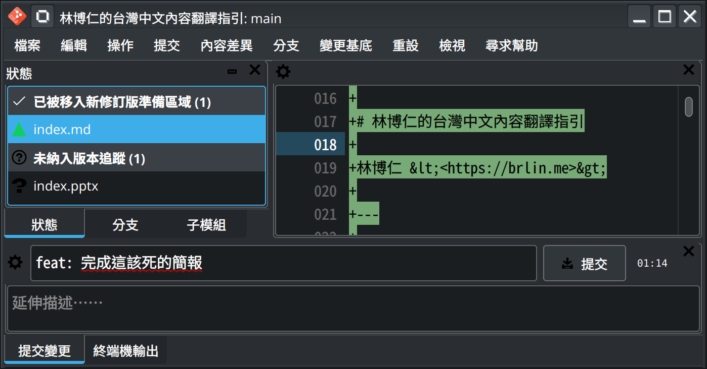

# 林博仁的台灣中文內容翻譯指引

林博仁 &lt;<https://brlin.me>&gt;

---

## 我是誰？

- 臺灣自由暨開源軟體在地化社群成員， ~~但是翻了不少專有軟體~~
- 從事 LibreOffice 等自由軟體開發工作，偶爾斜槓來作作台灣中文在地化 ~~，但都三分鐘熱度~~
- 台灣人

---

## 緣起

---

## 緣起（一言以蔽之）

由 CQD 所創作之 xkcd 非官方漫畫翻譯(CC-BY-NC-2.5)，來源：<https://xkcd.tw/927>

---

## 「內容」的定義

「內容」是指任何形式的資訊表達，包括但不限於：

* 文字（軟體界面、說明文件、網頁內容……）
* 圖片（梗圖、插圖……）
* 音訊（Podcast）
* 視訊（影片字幕……）

等媒體。

---

## ~~黑歷史~~ 範例（Git Cola）

---

## ~~黑歷史~~ 範例（Pokémon Sleep Tools）

---

## ~~黑歷史~~ 範例（Ubiquity）

---

## ~~黑歷史~~ 範例（Ubiquity(?)）

---

## ~~黑歷史~~ 範例（自由軟體，自由的社會：Richard Stallman 於 TEDxGeneva 2014 發表的演說）

---

## 翻譯的目標

盡可能地降低不同語言系統內容閱覽者理解內容涵義的成本

---

## 授權條款

除非另有註明([檔頭說明註解](https://reuse.software/spec-3.3/#comment-headers)/[REUSE.toml](https://reuse.software/spec-3.3/#reusetoml))，本作品以 [4.0 國際版（或其任意更近期版本）之「Creative Commons 姓名標示─相同方式分享」授權條款](https://creativecommons.org/licenses/by-sa/4.0/deed.zh-hant)釋出供大眾於授權條款範圍內自由使用。

本作品遵從 [REUSE 規範](https://reuse.software/spec/)，參閱 [REUSE - Make licensing easy for everyone](https://reuse.software/) 網站以了解本作品授權之相關資訊。
