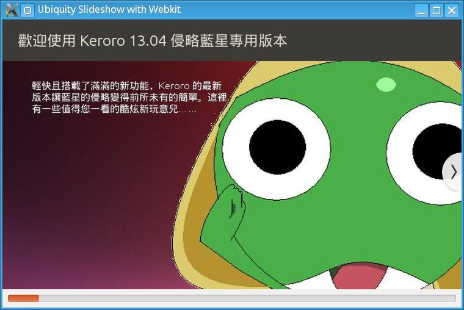

# 林博仁的台灣中文內容翻譯指引

林博仁 &lt;<https://brlin.me>&gt;

---

## 我是誰？

- 臺灣自由暨開源軟體在地化社群成員， ~~但是翻了不少專有軟體~~
- 從事 LibreOffice 等自由軟體開發工作，偶爾斜槓來作作台灣中文在地化 ~~，但都三分鐘熱度~~
- 台灣人

---

## 緣起

---

## 緣起（一言以蔽之）

由 CQD 所創作之 xkcd 非官方漫畫翻譯(CC-BY-NC-2.5)，來源：<https://xkcd.tw/927>

---

## 「內容」的定義

「內容」是指任何形式的資訊表達，包括但不限於：

* 文字（軟體界面、說明文件、網頁內容……）
* 圖片（梗圖、插圖……）
* 音訊（Podcast）
* 視訊（影片字幕……）

等媒體。

---

## ~~黑歷史~~ 範例（Git Cola）

---

## ~~黑歷史~~ 範例（Pokémon Sleep Tools）

---

## ~~黑歷史~~ 範例（Ubiquity）

---

## ~~黑歷史~~ 範例（Ubiquity(?)）

---

## ~~黑歷史~~ 範例（自由軟體，自由的社會：Richard Stallman 於 TEDxGeneva 2014 發表的演說）

---

## 翻譯的目標

盡可能地降低不同語言系統內容閱覽者理解內容涵義的成本

---

## 目標群體

您應以**內容的初學者**為目標群體來完善你的翻譯，翻譯應要是能夠在不偏離原意前提下讓初學者能夠**輕易理解並消化吸收**的。

如果一個翻譯會讓教育者無法簡單且精確地介紹給初學者的話（不包含「反正 ｘｘｘ 就是對應到 ｏｏｏ，至於為什麼你不用想<ruby>反正大家都這樣用<rt>因為我也不知道該怎麼解釋</rt></ruby>」），那那個翻譯可能就不是個好翻譯。

---

## 你應該翻譯什麼

* 平常有在用的軟體
* 符合你興趣、專業領域的軟體
* 說明文件、網站、推廣內容等

最好是在翻譯完後可以實際建構翻譯好的成果進行審閱，確保翻譯的內容是正確的。

## 你不應該翻譯什麼

* 你不熟悉/沒在用的軟體
* 為取得翻譯貢獻而翻譯
* 不是你的慣用語言的翻譯

也不是說絕對不能做，只是必須 **非常斟酌地** 進行。

---

## 盤古之白

因為當前大多數的<ruby>圖形化使用者界面<rt>graphical user interface(GUI)</rt></ruby>排版引擎尚未支援**自動在全形（中文）與半形（英數字等）字元間補入留白**影響視覺觀感所以我們**應**手動在全形字元與半形字元間插入單一空白字元以<ruby>規避<rt>workaround</rt></ruby>此問題。

錯誤範例：

> 於搜尋文字框中輸入cat跟game搜尋關鍵字

正確範例：

> 於搜尋文字框中輸入 cat 跟 game 搜尋關鍵字

---

## 盤古之白（可以省略之情境）

因為中式標點符號字元之兩側已經包含一定的空白，如半形字元任一側的全形字元為中式標點符號則該側的盤古之白**應**省略：

錯誤範例：

> 於文字輸入框中輸入： cat

正確範例：

> 於文字輸入框中輸入：cat

---

## 當我們不再需要盤古之白

如果未來<ruby>圖形化使用者界面<rt>graphical user interface</rt></ruby>排版引擎加入了盤古之白的支援再將這些手動插入之空白字元移除（理想上這些應該被自動偵測並直接被排版引擎忽略）。

---

## 標點符號

原則上**應**使用中式標點符號。

- **句號（。）**
- **逗號（，）**
- **頓號（、）**
- **分號（；）**    
- **冒號（：）**
- **問號（？）**
- **驚嘆號（！）**

---

### 引號

原則上**應**將英式引號替換為中式引號：

錯誤範例：

> 於搜尋文字框中輸入"cat"跟"game"搜尋關鍵字

正確範例（一）：

> 於搜尋文字框中輸入「cat」跟「game」搜尋關鍵字

---

### 引號（可以省略之情境）

因中英文外觀上的差異本來就足以突顯括住之內容，若確信引號括住之內容*一定*不會出現中文字**可**將引號直接省略：

正確範例（二）：

> 於搜尋文字框中輸入 cat 跟 game 搜尋關鍵字

如果不確定括住的內容是否會出現中文（如括住的內容為一變數）則**應**保留中式引號。

正確範例（三）：

> 於搜尋文字框中輸入「%s」搜尋關鍵字

---

### 句號

<ruby>句子<rt>sentence</rt></ruby>應以中式句號作為結尾。

---

### 句號（可以省略之情境）

一例外為在清單項目之內容，因美觀考量**應**將其省略：

錯誤範例：

> 今日行程安排：
> 
> - 吃飯。
> - 睡覺。
> - 打東東。

正確範例：

> 今日行程安排：
> 
> - 吃飯
> - 睡覺
> - 打東東

---

## 授權條款

除非另有註明([檔頭說明註解](https://reuse.software/spec-3.3/#comment-headers)/[REUSE.toml](https://reuse.software/spec-3.3/#reusetoml))，本作品以 [4.0 國際版（或其任意更近期版本）之「Creative Commons 姓名標示─相同方式分享」授權條款](https://creativecommons.org/licenses/by-sa/4.0/deed.zh-hant)釋出供大眾於授權條款範圍內自由使用。

本作品遵從 [REUSE 規範](https://reuse.software/spec/)，參閱 [REUSE - Make licensing easy for everyone](https://reuse.software/) 網站以了解本作品授權之相關資訊。
